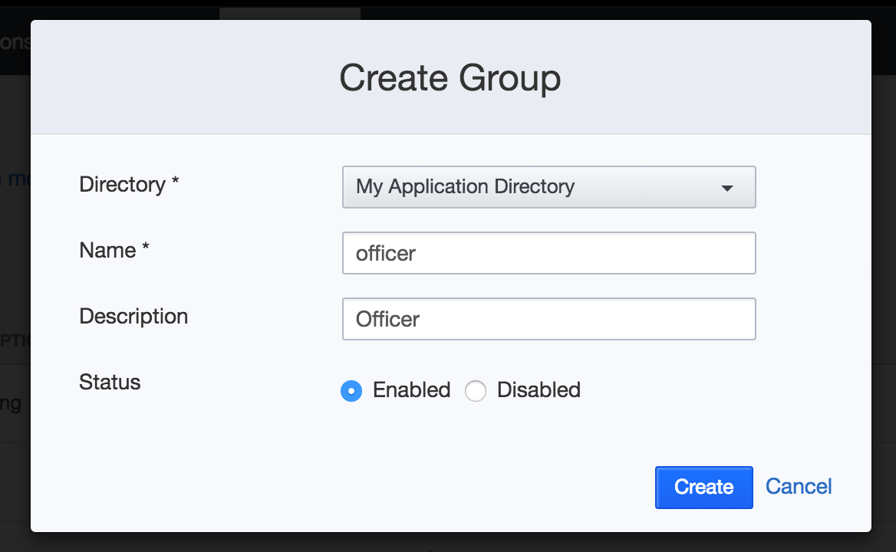
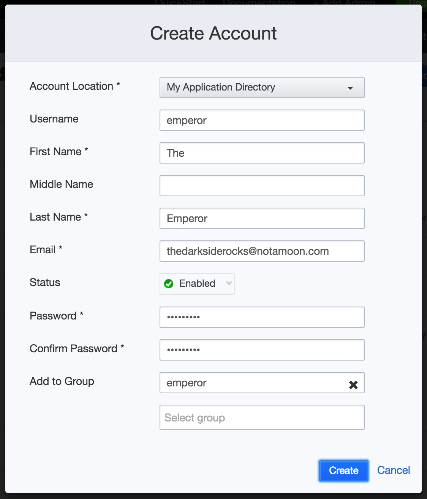

.. _tutorial:

Tutorial
========

This tutorial will take you from zero to a Stormpath enabled application featuring the |project| .

It should take about 30 minutes from start to finish. If you are looking for a bare bones intro to using Stormpath and
Apache Shiro, check out the :doc:`quickstart`.

If you've already gone through the quickstart, jump over to the :ref:`secure-the-app` section.

All of the code in the tutorial makes use of the ``stormpath-shiro-servlet-plugin``. This integrates Stormpath and Apache Shiro with minimal configuration.
This tutorial will start with an existing JAX-RS application, without any security, and walk through the steps required to
integrate Stormpath and Apache Shiro.

Topics:

.. contents::
  :local:
  :depth: 2

.. include:: get-api-key.txt

.. _secure-the-app:

Secure the Application
----------------------

For the rest of the tutorial, we will be referring to the tutorial code found `here <https://github.com/stormpath/stormpath-shiro/tree/master/tutorials/servlet>`__.

Each of the tutorial sections is completely standalone and can be run by executing a single Apache Maven command ``mvn jetty:run`` and then browsing to http://localhost:8080

Our Application
###############

The example application is a simple JAX-RS application with a ``trooper`` resource for basic CRUD operations.

Grab the code from `here <https://github.com/stormpath/stormpath-shiro/tree/master/tutorials/servlet/00-initial-app>`__, and start the application using ``mvn jetty:run``.

You can open a browser to http://localhost:8080/trooper and a json object containing fifty random Stormtroopers will be
returned.  Once you verify you have everything working, you can kill the process using ``^C``.

Add Authentication
##################

Adding authentication to this application is as easy as adding a dependency and then telling Apache Shiro which paths you
want to protect.

The dependency in our pom.xml looks like this:

.. parsed-literal::

    <dependency>
        <groupId>com.stormpath.spring</groupId>
        <artifactId>stormpath-default-spring-boot-starter</artifactId>
        <version>\ |version|\ </version>
    </dependency>

Our basic ``shiro.ini`` from ``src/main/resources/`` is as follows:

.. code-block:: ini
   :emphasize-lines: 13-15

    [main]
    # Shiro and the Stormpath API can use the same configured Cache Manager (optional)
    cacheManager = org.apache.shiro.cache.MemoryConstrainedCacheManager
    securityManager.cacheManager = $cacheManager
    stormpathClient.cacheManager = $cacheManager

    # we can disable session tracking completely, and have Stormpath manage it for us (optional)
    sessionManager = org.apache.shiro.web.session.mgt.DefaultWebSessionManager
    securityManager.sessionManager = $sessionManager
    securityManager.sessionManager.sessionIdCookieEnabled = false
    securityManager.sessionManager.sessionIdUrlRewritingEnabled = false

    [urls]
    # Ant-style path matching
    /** = authc

    [stormpath]
    # you can set your application href here, a System Property with the same name 'stormpath.application.href ',
    # or via an environment variable 'STORMPATH_APPLICATION_HREF', this is required if you have more then one application
    # in your Stormpath tenant.
    # stormpath.application.href = https://api.stormpath.com/v1/applications/<APPLICATION_ID>

The highlighted lines above tell Apache Shiro to protect all paths, in other words, every resource in our application requires authentication.

Start up the application, again by using ``mvn jetty:run``, and navigate to http://localhost:8080/trooper where you will
be redirected to the login page.  At this point you can login with an existing user or register a new user, once logged in,
navigate to http://localhost:8080/trooper .

The need to retype the URL can be fixed by adding setting the ``stormpath.web.login.nextUri`` property.  In the ``[stormpath]`` section of the ``shiro.ini``, add the following line:

.. code-block:: ini
   :emphasize-lines: 3

    [stormpath]
    ...
    stormpath.web.login.nextUri = /trooper

Restart the application, this time after logging in you will be automatically redirected to ``/trooper``.

Using Roles
-----------

At this point your code should look like `this <https://github.com/stormpath/stormpath-shiro/tree/master/tutorials/servlet/01-add-security>`__. Simply adding authentication to the application is a
great first step, but typically it is not enough, as different users need different types of access.  The following sections will discuss authorization options.

In this section you will create Stormpath groups, assign those groups to users, and finally use the groups as Shiro roles.

Create Groups
#############

Log in to the `Stormpath Admin Console <https://api.stormpath.com>`_ and click on the 'Groups' tab.  Next click the 'Create Group' button.

Select the directory associated with your application (typically 'My Application Directory' unless you have changed this).

Enter 'underling' for the name and 'Underling' for the description and press the 'Create' button.  Repeat this process two more times
for the 'officer' and 'emperor' groups.

These three groups ``underling``, ``officer``, and ``emperor`` in our tutorial will represent a basic user, power-user, and administrator.

You can read more about groups in the `Stormpath Product Guide <http://docs.stormpath.com/console/product-guide/#create-a-group>`_ .

Assign Groups to Users
######################

Using the `Stormpath Admin Console <https://api.stormpath.com>`_, create three users, one for each role.  You can assign groups to users as you create them.

Groups are Roles
################

By default Stormpath groups are mapped to Shiro roles using the group's HREF.  We recommend using using the ``HREF`` or ``ID``
of the role as those are immutable, unlike the group's name. In this example however, we will use the group's name which will
make following along the tutorial easier.  You can read more about group configuration in the :ref:`access-control` documentation.

Change the group mode to ``NAME`` and update thepath mappings in our ``shiro.ini``:

.. code-block:: ini
   :emphasize-lines: 3,5,6,7

    [main]
    ...
    stormpathRealm.groupRoleResolver.modeNames = NAME

    [urls]
    /trooper = authc
    /trooper/** = authc,roles[officer]

Restart your application and browse to http://localhost:8080/trooper and all logged in users will be able to see the list
of stormtroopers, but only users with the ``officer`` role can view or edit a specific trooper via ``/trooper/<id>``

Using Permissions
-----------------

Roles are great for some use-case, but for others they fall short. If you require fine grained access control over your resources
then permissions are the way to go.  Apache Shiro uses `wild card permissions <http://shiro.apache.org/permissions.html>`_, which will provide
a great deal of flexibility.

Permission strings can be stored in custom data associated with groups or accounts. By default the |project| looks for a custom data entry named ``apacheShiroPermissions``

Back in the `Stormpath Admin Console <https://api.stormpath.com>`_ click on the 'Groups' tab again and edit each of the groups you created above.

.. image:: _static/group-custom-data.png

Each group's custom data so each group matches the table below:

.. list-table::
  :header-rows: 1

  * - Group
    - Custom Data
    - Description

  * - underling
    - .. code-block:: javascript

        {
          "apacheShiroPermissions": [
             "tutorial:trooper:read"
          ]
        }
    - Underlings will only be allowed to read.

  * - officer
    - .. code-block:: javascript

        {
          "apacheShiroPermissions": [
             "tutorial:trooper:create,read"
          ]
        }
    - | Officers will be able to create and read.
      | This is equivalent to granting both
      | ``tutorial:trooper:create`` and
      | ``tutorial:trooper:read`` permissions.

  * - emperor
    - .. code-block:: javascript

        {
          "apacheShiroPermissions": [
             "*"
          ]
        }
    - The emperor can do what ever he wants.

Finally, update the ``[urls]`` section of your ``shiro.ini`` to use these permissions.

.. code-block:: ini
   :emphasize-lines: 2,3

    [urls]
    /trooper = authc,rest[tutorial:trooper]
    /trooper/** = authc,rest[tutorial:trooper]

The special ``rest`` permission will append the equivalent CRUD operation to the corresponding request method.  For this
simple application we are only worried about GET (read) and POST (create). So users with ``tutorial:trooper:read`` will be
able to view the list of stormtroopers, and view the ``/troopers/<id>`` resource.  And users with ``tutorial:trooper:create``
will be able to create new stormtroopers.

Wrapping Things Up
------------------

At this point we have gone through creating users and groups, mapping groups to roles, and storing permissions custom data. If you have been following along your application should look like `this <https://github.com/stormpath/stormpath-shiro/tree/master/tutorials/servlet/03-use-permissions>`__ .

We have focused almost entirely on configuration inside of the ``shiro.ini`` file, adding entries to the ``[stormpath]`` section to configure how the Stormpath API functions, and the ``[urls]`` section to map our resources to roles or permissions.

Instead of defining your access requirements in your ``shiro.ini`` file, you can use `annotations <http://shiro.apache.org/authorization.html#Authorization-AnnotationbasedAuthorization>`_ or directly
`in your code <http://shiro.apache.org/authorization.html#Authorization-ProgrammaticAuthorization>`_ .  Furthermore, if you need access to the Stormpath API, you :ref:`can do that too <request>` .

